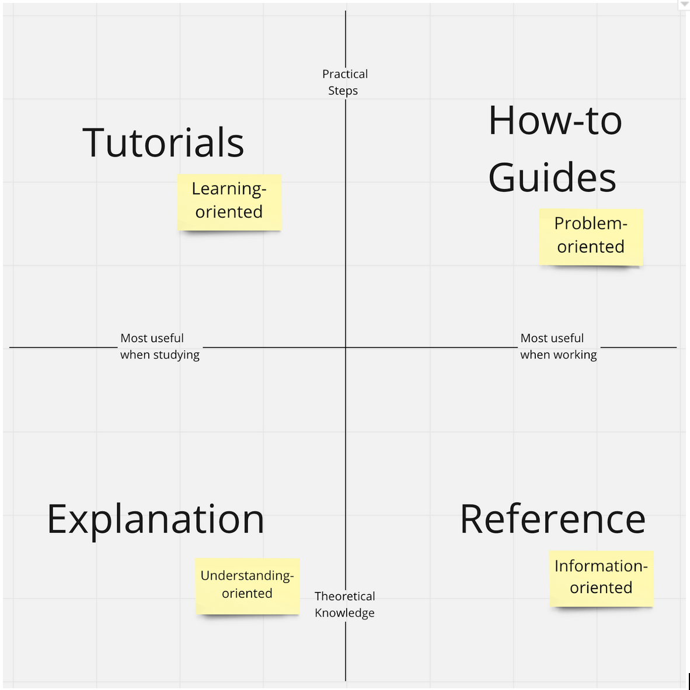

The Four Types of Documentation
===============================

The “four types” model helps to describe the different needs that people bring to documentation at different times. For most projects, all four types of documentation are required.