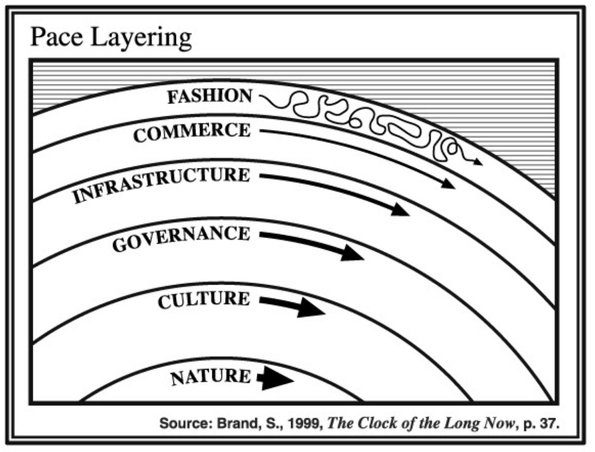

Pace Layering
=============

Pace layering describes how different components of a system change at different rates, and how these layers interact. Layers closer to the centre move more slowly, and provide a stabilising effect. Layers on the outside change more quickly, responding to change in the environment almost immediately.

Layers further out are also:
Easier to describe - you can demonstrate that “red clothes are popular in my city this season” much more readily than any statement that is universally true of nature. 
More applicable to immediate circumstances - warm coats are in fashion in some countries for a few weeks or months when the weather is colder, and then out of fashion again as the weather warms up 
Where innovation and experimentation are easier - a new technique, a new textile, a new machine can be tried out without changing government, or culture. 
Small drivers for change of lower layers - with decreasing influence the lower down the stack you go
Stabilised by lower layers - the bounds of what can be in fashion are set by by the lower layers

A data standard and its tooling can be positioned using pace layering, and this positioning allows us to understand the expected properties of the standard, as well as what else is required around it in order for it to be impactful. 

Typically, a data standard can be positioned in pace layers by the concept that it’s modelling - if the concept changes rapidly, then it should be further up. The further up the layers the standard is, the more it will benefit from the use of standards that model concepts further down in order to help to stabilise it. Conversely, standards that are lower down will often need to be adapted or put to use by models further up in order to be meaningful. 

For example, ISO 8601 is a standard that describes how to model dates using the Gregorian calendar. Calendars typically change over multi-century timescales, so it’s clearly low down on the layers. A date always needs context in order to mean anything - and so ISO 8601 is usually used by other standards to describe when a particular thing happens. 

(Image reproduced from https://blog.longnow.org/02015/01/27/stewart-brand-pace-layers-thinking-at-the-interval/ under license CC BY-SA 3.0)